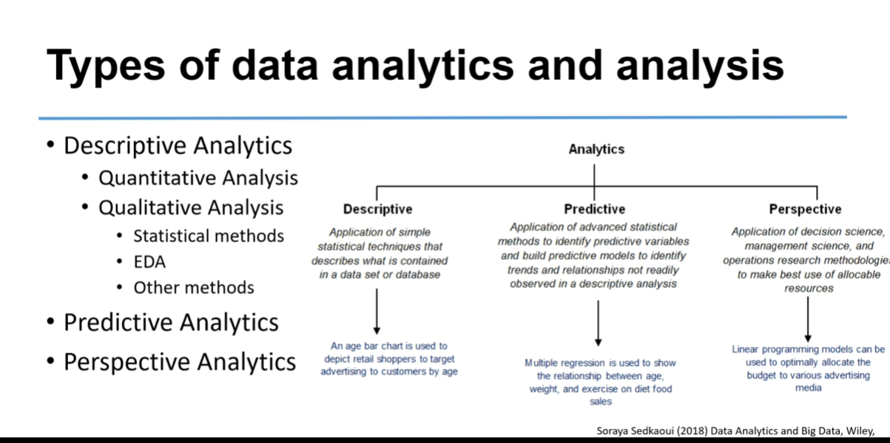
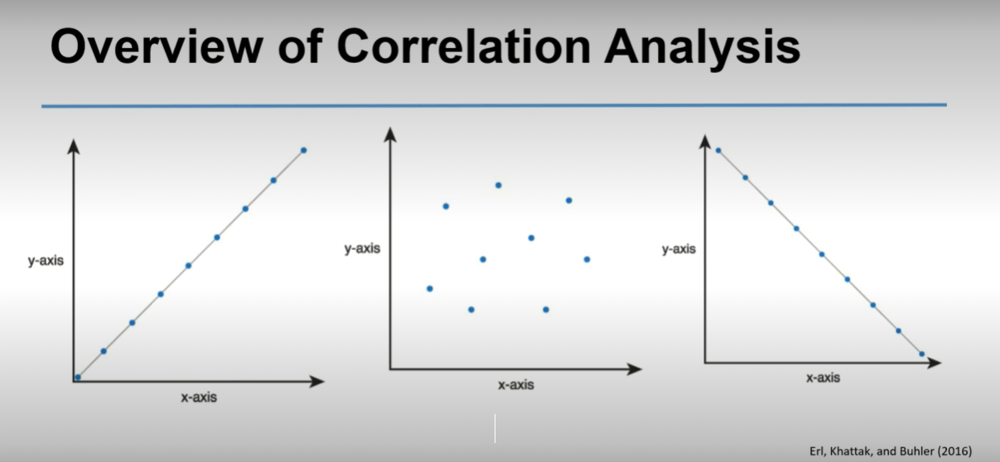
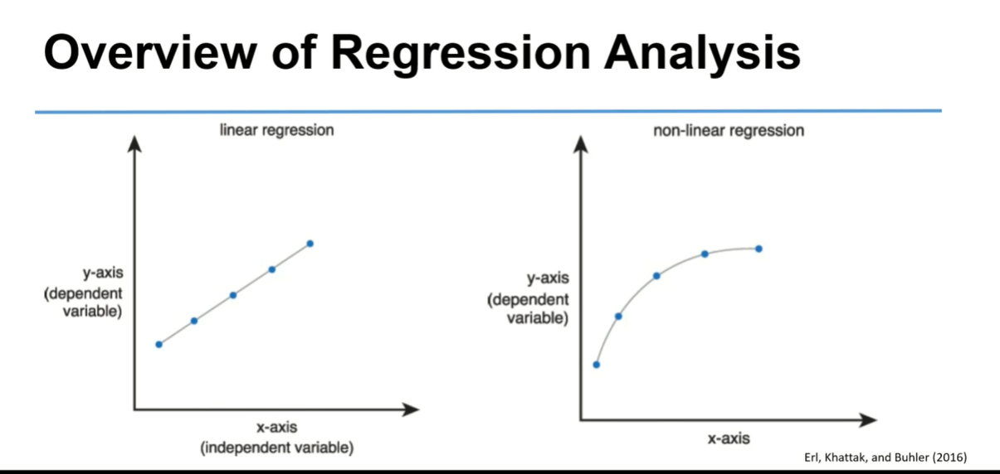
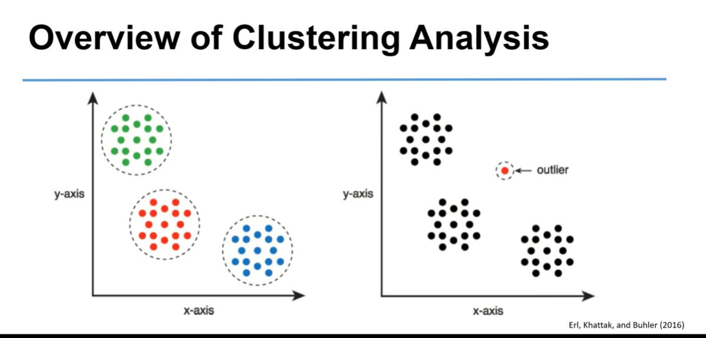

# 1.0.0: Week 1 Introduction

Weekly Introduction

    Welcome to Week 1! During this week we will cover a brief, clear and concise overview of the field of data sciences and the evolution of big data from a technical point of view. You will see how to harness the power of a large amount of data, big data and data science for new insights and information using appropriate data analysis tools and technologies. You will see why you want to use data visualization and why you might prefer to use Python and associated tools for developing your data science project or business. Then we're going to go over some simple examples of how to actually use these tools.

## DUE: Early in the week

### Read 
the following early in the week to help you respond to the discussion questions and to complete your assignment(s).

#### Required Readings:
- Ceder, N (2018) The Quick Python Book. Third Edition, Manning Publications Co, Shelter Island, Chapter One and Chapter two. (WO 3)
- The Data Science Venn Diagram (Links to an external site.) (Read later in the week) (WO 2,3)
#### Suggested readings:
- (2015) Data Science and Big Data Analytics: Discovering, Analyzing, Visualizing and Presenting Data. Wiley, Chapter one. (WO 1,2)

## 1.1: What is Data Science?
    Data Science is not about Data, Math or Statistics and surely is not about fundamentals Sciences practised in the research laboratories. This presentation provides an introduction to data science concepts and their importance. Since this module is rather hands-on and technical, you should know precisely what it is about and what it is not about. This will help you to focus your efforts in the right direction as you are required to use various tools and technologies in data science and apply them to your data effectively. We are also looking into some popular tools used in data science.

    
Read through the presentation as I explain the following topic: Toward a better and more technical understanding of Data Science, its importance and required tools

 

As you view the presentation, reflect on the following:

What is data science about and what isn’t it about?
What is the science in data science about?
Is data science a new science or new data type or just a new jargon?
Why is so important?
Why do we want to visualize data and what is its significance?

While you watch this lecture, reflect on the below questions.

    Are there any additional reason, not listed in the video, for big data systems failure?
    What might be the extended impact on an organisation of a big data system failure?
    Are there any circumstances where failure of big data may have an effect on a wide population?

## BOOK NOTES
### The Quick Python Book chapter 1
#### Types are associated with objects, not variables. 
- A variable can be assigned a value of any type, and a list can contain objects of many different types. This also means that type casting usually isn’t necessary, and your code isn’t locked into the straitjacket of predeclared types.
####  Python typically operates at a much higher level of abstraction. 
- This is partly the result of the way the language is built and partly the result of an extensive standard code library that comes with the Python distribution. A program to download a web page can be written in two or three lines!
#### Syntax rules are very simple. 
- Although becoming an expert Pythonista takes time and effort, even beginners can absorb enough Python syntax to write useful code quickly.

      Python is a very expressive language. Expressive in this context means that a single line of Python code can do more than a single line of code in most other languages. The advantages of a more expressive language are obvious: the fewer lines of code you have to write, the faster you can complete the project. Not only that, but the fewer lines of code there are, the easier the program will be to maintain and debug.

#### Indentation
- Python’s main advantage in this department is its use of indentation. Unlike most languages, Python insists that blocks of code be indented.

- Python, you should have everything you need to do real work, without the need to install additional libraries. 
- This is why the Python standard library comes with modules for handling email, web pages, databases, operating system calls, GUI development, and more.

For example, with Python, you can write a web server to share the files in a directory with just two lines of code:

      import http.server
      http.server.test(HandlerClass=http.server.SimpleHTTPRequestHandler)

      
Python is a modern, high-level language, with many features:

Dynamic typing
Simple, consistent syntax and semantics
Multiplatform
Well-planned design and evolution of features
Highly modular
Suited for both rapid development and large-scale programming
Reasonably fast and easily extended with C or C++ modules for higher speeds
Easy access to various GUI toolkits
Built-in advanced features such as persistent object storage, advanced hash tables, expandable class syntax, universal comparison functions, and so forth
Powerful included libraries such as numeric processing, image manipulation, user interfaces, web scripting, and others
Supported by a dynamic Python community
Can be integrated with a number of other languages to let you take advantage of the strengths of both while obviating their weaknesses

## IDLE Python shortcuts
        Everything in your session is buffered. You can scroll or search up, place the cursor on any line, and press Enter (creating a hard return), and that line will be copied to the bottom of the screen, where you can edit it and then send it to the interpreter by pressing the Enter key again. Or, leaving the cursor at the bottom, you can toggle up and down through the previously entered commands using Alt-P and Alt-N. This will successively bring copies of the lines to the bottom. When you have the one you want, you can again edit it and then send it to the interpreter by pressing the Enter key. You can complete Python keywords or user-defined values by pressing Alt-/.

## Python terminals
### Windows search python3
-  try pressing the up arrow key a few times. Notice how this recalls previous lines of Python code. You can use the left and right arrow keys to move backwards and forwards through a recalled line and can delete text or insert new text in the usual way.**
### IDLE 
- Try entering some Python code at the prompt to satisfy yourself that it behaves similarly to the interactive interpreter seen earlier. (One important difference is that you move through the history of previous lines using Alt+P and Alt+N instead of the up and down arrows). Now let’s edit and run the program created earlier. Choose Open... from IDLE’s File menu, or just press Ctrl+O. Navigate to your desired directory and double-click on hello.py to open it
# Week 4

## Correltaion
- is an analysis technique
- says if 2 things are related
- how close are they related
    - how does var a increace in correlation with var b
    - helps discover patterns and anaomolies
- if they are correlated
    - commonly used for data mining 
    - can reveal the nature of a dataset
    - aligned on a linear relationship
        - this means when one var changes so does the other one also changes, proportionally and constantly
        - expressed as a decimal between -1 and 1 - **correlation coeficent**
        - strong to weak when moving from -1 to 0, or, +1 to 0

**image**   
**- first plot shows +1 correlation, strong positive (up) correlation between 2 variables** &nbsp;  
**- second plot shows 0 correlation, suggesting there is NO relationship (0) between 2 variables**   
**- third plot shows -1 correlation, suggesting there is a strong negative (down) correlation between 2 variables**

**image   linear and non linear regression**

### correlation does not emply causation.

## clustering
- data clustered by an algorithm - 
- generally used in data mining
- differnet clusters formed for different algorithms used.
- classifcation can be used to make better desistions on clusters
- skattergraph provides visual representation of a scatter plot.
    - visually identifies outliers (image: plot 2)
- grouped using clustering
- outlier detection
    - identify differnt datasets from or incosistent from rest of dataset
    - machine learning technique to identify anomolies, abnormaliteis 
        - could identify risks or opportunites
        - closely related to clustering
        - fraud detectjon, sensor data analysis

 

### Read:  

EMC. (2015) Data Science and Big Data Analytics: Discovering, Analyzing, Visualizing and Presenting Data. Wiley, Chapter three, section 3.3 to 3.3.3. (exclusive)