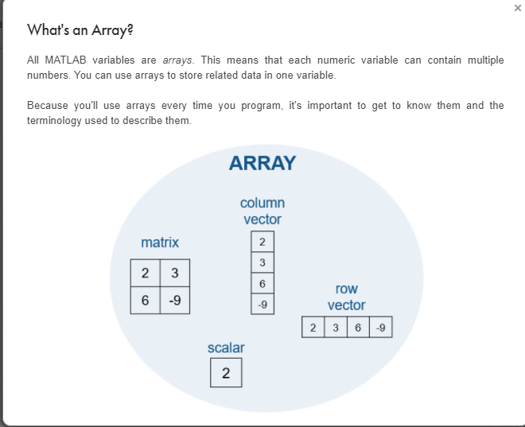

# Machine Learning Notes

## Lecture 1: (1.1)

Machine learning
  ~ Teaching machine what comes naturally to humans/animals
  ~ Posteriori knowledge driven, learning from experiences

### Solve Real World Problems

1. Energy Production
2. Computer Vision and image processing
3. Computational Biology
    - DNA sequencing

### How it works

#### Supervised Learning
    
    1. A model is trained to accept an input and and output

#### Unsupervised Learning 
    1.  Find intrinsic or hidden features of the data (i.e. inputs) that have no labelled output (or response)

# Matlab

### Matlab array indexing
- starts at 1 (not zero)
- matrix indexing is x(row,col)
    - so x(: , 3)
    - refers to all values in the third row of the matrix

### vectors indexing
- vectors only have 1 index
- because there 1D
- they're not a matrix, just an array

### Supervised learning techniques
1. Classification techniques
    - predict descrite responses
2. Regression techniques
    - predict continuous responses

# Types of classification
## Urinary classification
1. One class classifcation (OCC)
2. finds outliers
3. It's much more complex than other classification types
4. Real world examples:
    - Classification of network traffic in a secure software-defined network as normal
    - Monitoring the operational status of a neuclar power plant:  there are few examples of catastrofic issues in a power plant but many normal examples
    
## Binary classification
1. Or binomial classification
2. Classifies elements of a set into two groups
3. e.g. spam/not-spam

## Multiclass classification
1. Or multinomial classification
2. if the size of the class is 3 or more - multinomial/multiclass
3. Qualitative credit score assignment i.e. good credit, poor, excellent, exemplary

## Multilabel classification
1. similar to multiclass but have multiple labels involved
2. each training example has many lables
3. i.e. descriving an image: people, truck, vegetation and lion labels in a photo of a truck in a sahara lion tour
## Imbalanced classification
1. The number of observations in each class is unequally distributed
2. Generally can be modelled as binary classification tasks
- majority of data in training data set - belong to normal class
- minority of data in training set - abnormal class
3. Can be a slight to a severe inbalance
4. Used in fraud detection, outlier detection and medical diagnosis